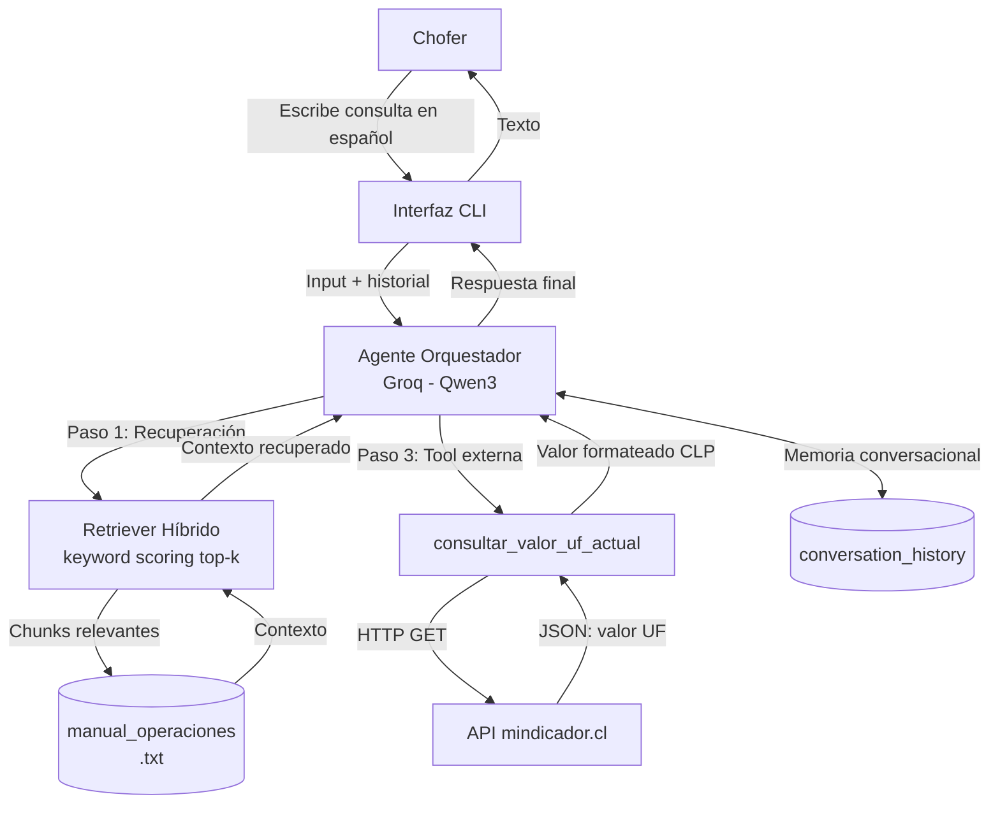

# Arquitectura del Asistente de Operaciones y Flota

## Diagrama de Arquitectura

## Componentes

| Componente | Descripción |
|---|---|
| **Interfaz CLI** | Bucle interactivo que captura la entrada del chofer y muestra la respuesta. Mantiene el historial de mensajes por sesión. |
| **Agente Orquestador** | Modelo Qwen3 servido por Groq (API compatible con OpenAI). Temperatura 0.1 para respuestas deterministas y `reasoning_effort="none"` para desactivar el razonamiento extendido. |
| **Retriever Híbrido** | Carga el manual, lo divide por secciones y puntúa cada chunk según coincidencia de palabras clave con la consulta, devolviendo los top-k más relevantes. |
| **Base de conocimiento** | `data/manual_operaciones_logistica.txt` con 6 secciones (fallas, siniestros, jornada, mantenimiento, combustible, talleres). |
| **consultar_valor_uf_actual** | Consulta la API externa mindicador.cl para obtener el valor vigente de la UF. Incluye User-Agent, timeouts y reintentos. |
| **API mindicador.cl** | Servicio público chileno que entrega indicadores económicos diarios, incluyendo el valor de la UF. |
| **Memoria conversacional** | Lista `conversation_history` con los turnos previos que se inyecta en cada llamada al LLM. |

## Flujo de Ejecución

1. El chofer escribe una pregunta en la CLI.
2. El sistema recupera los chunks más relevantes del manual (RAG).
3. Si la consulta involucra UF o conversión a pesos, se invoca `consultar_valor_uf_actual` y se añade al contexto.
4. El LLM recibe system prompt + historial + contexto + pregunta.
5. El agente genera una respuesta fundamentada y el turno se guarda en memoria.
6. Si la información no está en las fuentes, el agente lo declara explícitamente (mitigación de alucinaciones).
