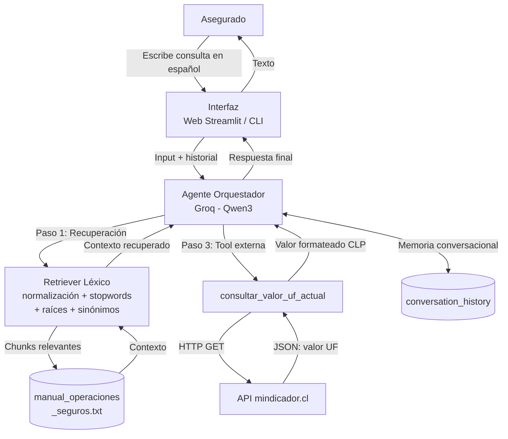

# Arquitectura del Asistente Inteligente de Seguros — Seguros Express

## Diagrama de Arquitectura

## Componentes

| Componente | Descripción |
|---|---|
| **Interfaz (Web / CLI)** | La web (`app.py`, Streamlit) y la CLI (`src/agent.py`) comparten el mismo pipeline. La web muestra burbujas de chat, preguntas rápidas y un panel de **Fuentes consultadas**; la memoria vive en `st.session_state` por sesión de navegador. |
| **Agente Orquestador** | Modelo Qwen3 servido por Groq (API compatible con OpenAI). Temperatura 0.1 para respuestas deterministas y `reasoning_effort="none"` para desactivar el razonamiento extendido. |
| **Retriever léxico** | Carga el manual, lo divide por secciones y puntúa cada chunk combinando **normalización de acentos**, **stopwords**, **raíces (prefijos)** y un **mapa de sinónimos** del dominio. Devuelve los top-k más relevantes y vacío si no hay coincidencias de contenido. |
| **Base de conocimiento** | `data/manual_operaciones_seguros.txt` con 6 secciones (asistencia en ruta, siniestros, coberturas y exclusiones, reembolsos, primas y vigencia, red de prestadores). |
| **consultar_valor_uf_actual** | Consulta la API externa mindicador.cl para obtener el valor vigente de la UF. Incluye User-Agent, timeouts y reintentos. |
| **API mindicador.cl** | Servicio público chileno que entrega indicadores económicos diarios, incluyendo el valor de la UF. |
| **Memoria conversacional** | **Buffer de ventana deslizante** (`ConversationBufferWindowMemory`) que conserva los últimos `MEMORY_MAX_TURNS` turnos (por defecto 5) y descarta los más antiguos. Se persiste en `.memory/session.json` para sobrevivir entre ejecuciones. |

## Tipo de memoria: Buffer de ventana deslizante

La memoria implementada en `src/memory.py` es un **buffer de ventana deslizante**
(`ConversationBufferWindowMemory`). Se eligió este tipo porque:

- **Acota el contexto**: mantiene solo los últimos `N` intercambios, evitando que
  el prompt crezca indefinidamente y dispare costos o límites de tokens.
- **Conversación multi-turno**: permite resolver referencias como *"¿y eso en pesos?"*,
  que dependen del turno anterior.
- **Persistencia opcional**: guarda la sesión en disco (`.memory/session.json`),
  de modo que el hilo conversacional se recupera al reiniciar.

Parámetros configurables (en `.env`):

| Variable | Descripción | Default |
|---|---|---|
| `MEMORY_MAX_TURNS` | Número de intercambios (usuario + asistente) que se conservan | `5` |
| `MEMORY_PERSIST_PATH` | Ruta del archivo de persistencia de la sesión | `.memory/session.json` |

## Recuperación (RAG léxico)

`src/rag_pipeline.py` implementa recuperación **sin dependencias externas**:

1. **Normalización**: minúsculas y eliminación de acentos (`unicodedata`), de modo
   que `poliza` coincida con `Póliza`.
2. **Stopwords**: se descartan palabras vacías (`el`, `es`, `para`, `cual`…), que
   antes dominaban el puntaje y desplazaban a la sección correcta.
3. **Raíces / prefijos**: coincidencia parcial (`reemb` une `reembolso` y
   `reembolsan`; `grua` une `grúa` y `gruas`).
4. **Sinónimos de dominio**: `siniestro → accidente/choque`,
   `cobertura → cubre`, `grúa → auxilio/remolque`, etc.
5. **Ponderación de título**: una coincidencia en el título de la sección suma
   puntaje extra.

Si ninguna palabra de contenido coincide, se devuelve una lista vacía y el
agente responde que no tiene la información (comportamiento anti-alucinación).

## Flujo de Ejecución

1. El asegurado escribe una pregunta en la web o la CLI.
2. El sistema recupera los chunks más relevantes del manual (RAG).
3. Si la consulta involucra UF o conversión a pesos, se invoca `consultar_valor_uf_actual` y se añade al contexto.
4. El LLM recibe system prompt + historial + contexto + pregunta.
5. El agente genera una respuesta fundamentada y el turno se guarda en memoria.
6. Si la información no está en las fuentes, el agente lo declara explícitamente (mitigación de alucinaciones).
