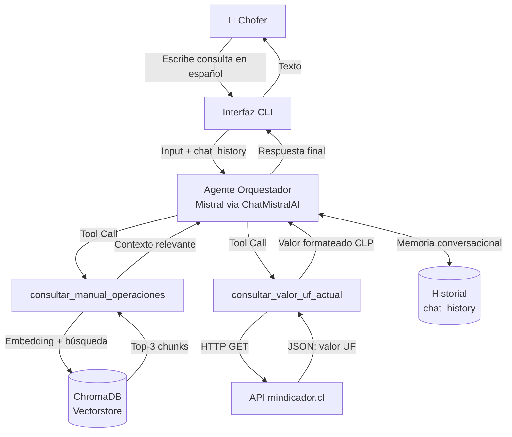

# Arquitectura del Asistente de Operaciones y Flota

## Diagrama de Arquitectura

## Componentes

| Componente | Descripción |
|---|---|
| **Interfaz CLI** | Bucle interactivo que captura la entrada del chofer y muestra la respuesta del agente. Mantiene el historial de mensajes por sesión. |
| **Agente Orquestador** | Modelo Mistral (ChatMistralAI) con tool calling. Decide qué herramienta invocar según la consulta del usuario. Temperatura baja (0.1) para respuestas deterministas. |
| **Memoria Conversacional** | Historial de mensajes (`chat_history`) que se pasa en cada iteración, permitiendo al agente mantener contexto entre turnos de la conversación. |
| **consultar_manual_operaciones** | Tool que realiza búsqueda semántica sobre el manual de operaciones almacenado en ChromaDB. Usa embeddings de Mistral para convertir la consulta en vector. |
| **ChromaDB Vectorstore** | Base de datos vectorial que almacena los chunks del manual de operaciones (split con chunk_size=700, overlap=100). Retorna los 3 fragmentos más relevantes. |
| **consultar_valor_uf_actual** | Tool que consulta la API externa mindicador.cl para obtener el valor actual de la Unidad de Fomento (UF) en tiempo real. |
| **API mindicador.cl** | Servicio público chileno que proporciona indicadores económicos, incluyendo el valor diario de la UF. |

## Flujo de Ejecución

1. El chofer escribe una pregunta en la CLI.
2. El agente recibe el input + historial y evalúa si necesita usar herramientas.
3. Si la consulta es sobre procedimientos internos → invoca `consultar_manual_operaciones`.
4. Si la consulta involucra valores en UF → invoca `consultar_valor_uf_actual`.
5. El agente sintetiza la información de las herramientas + su conocimiento base.
6. La respuesta se muestra al chofer y el mensaje se agrega al historial.
